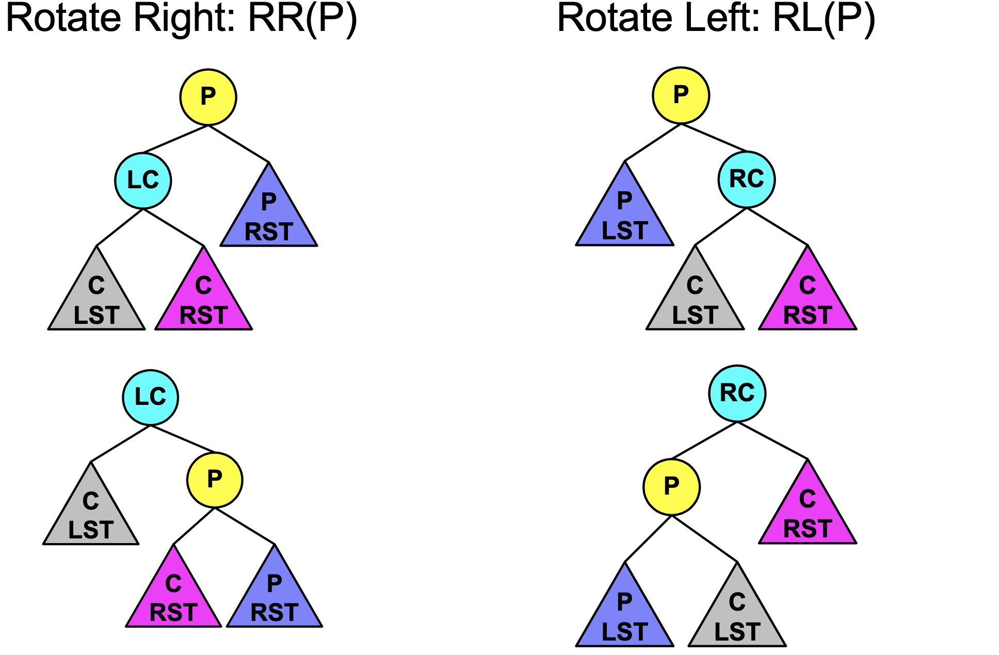
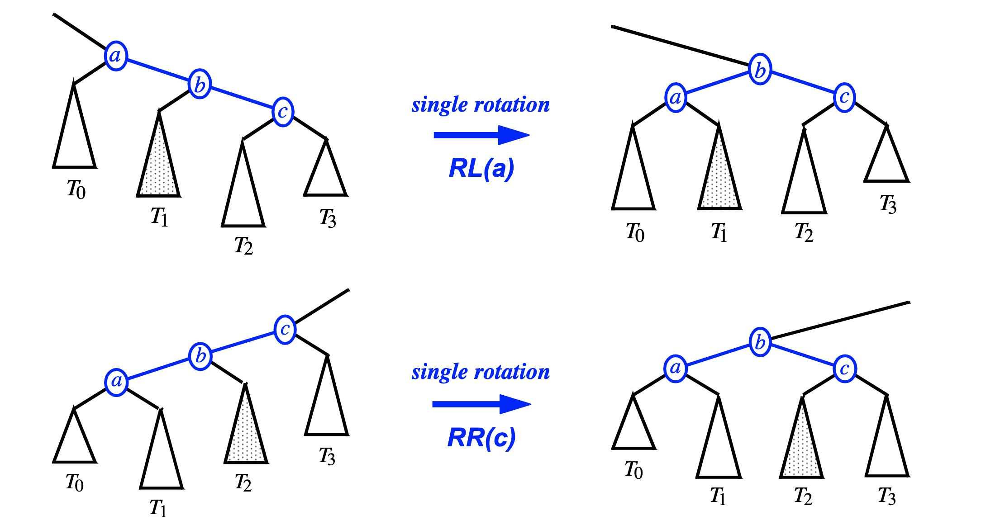
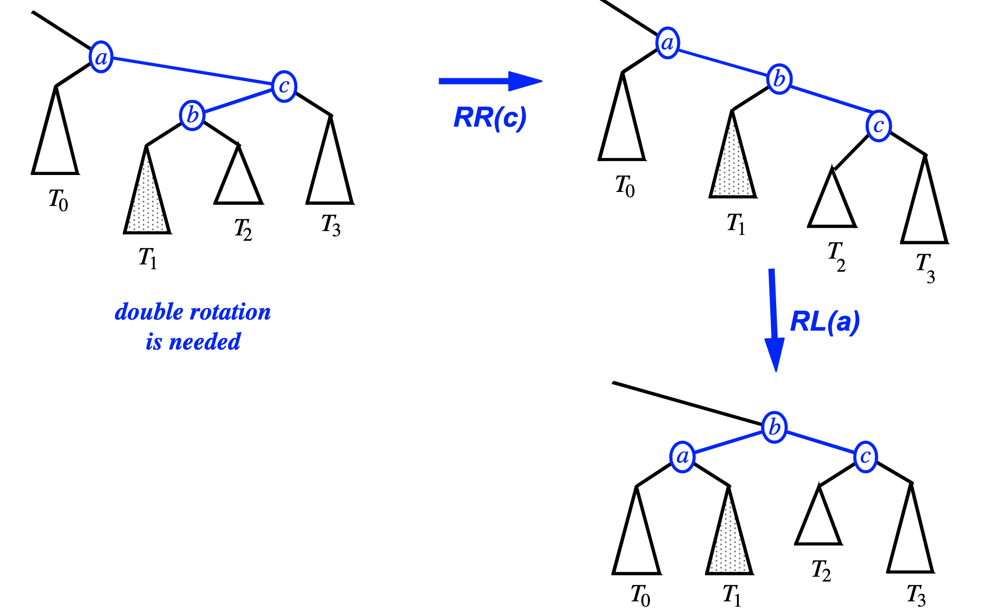
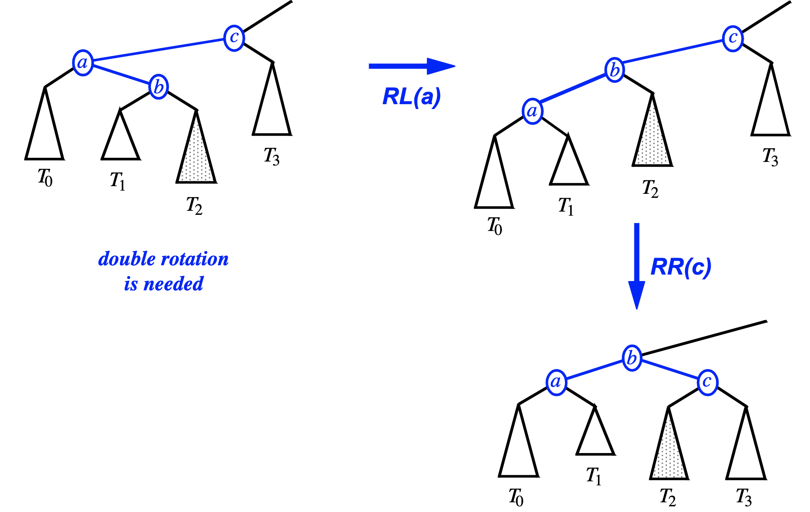
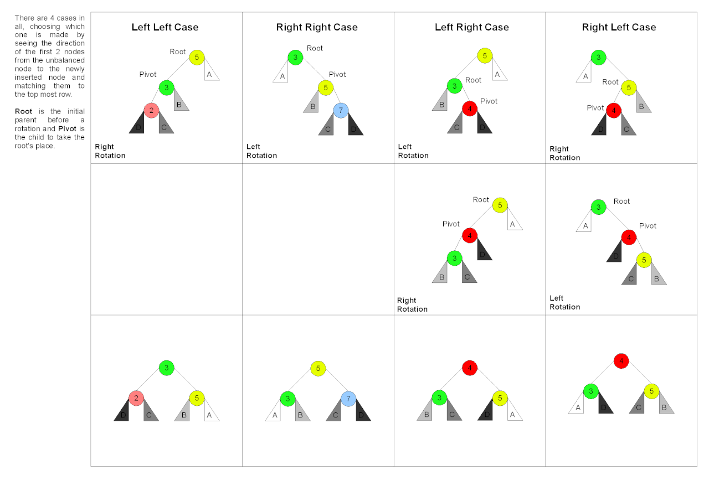

# EECS281 note
## Hash Table
#### Separate Chaining
store colliding key-value pairs in a **linked list for that bucket**
#### Open Addressing
store colliding key-value pairs in **another bucket/location**

#### Linear Probing
if bucket not available, try buckets after that linearly. 
* `(H(k) + i) % N`

#### Hash function
hash function can match the key to certain position, may cause collision, best hash function is hard to write. 


Here is an example
````C++
int hash(string s){
if(s.empty())
  return 0
else
  return s[0] - 'a';

}

````

#### Quadratic probing
Interval between probes is increased by adding a quadratic polynomial until open spot is found
* `(H(k) + i^2) % N`

#### Double Hashing
Interval probes is computed using another hash function
Try buckets H(k), H(k) + F(k), H(k) + 2F(k)....

* `(H(k) + i*F(k)) % N`

H(k) is the first hash function, F(K) is the second hash function
Linear | Quadratic | Double Hashing
--- | --- | ---
`(H(k) + i) % N`| `(H(k) + i^2) % N` | `(H(k) + i*F(k)) % N`

#### Hash function deletion
// TODO
* if hash_key spot is empty
* if hash_key spot is occupied, just make it the type deleted
* if hash_key spot is deleted

#### Hash Table Performance
`load factor = # elements/# buckets`
* use prime numbers for table sizes, important for modulus and reduuce collision
* keep load factor low: `< 0.75`

####Time Complexities
k = number of keys, n = table size

Search | Inseart | Delete
--- | --- | ---
O(1 + k/n) | O(1 + k/n) | O(1 + k/n) 

`Space Complexity: O(n)`

Fundamentally, `still O(1)` assuming a reasonable load factor (a <= ~0.5)

#### Comparison
Separate Chaining | Open Addressing
--- | ---
faster handling collisions | requires deleted elements for erase
can have load factor > 1 | Cache locality improves runtime
`Fast insert and delete in middle of list ` | `can random access`


### Tree Fundamentals

Simple Tree | Rooted Tree
--- | ---
Acyclic connected graph, considered undirected | a simple tree with a selected node(root), all edges are directed away from root

Tree Terminology | `Ancestor ` | ` Descendent`
--- | --- | ---
---| parent of a parent | child of a child (further from root) 

`Height`
````C++
height(empty) = 0;
height(node) = max(height(node -> left), height(node-> right)) + 1;
````

`Size`
````C++
size(empty) = 0
size(ndoe) = size(left_child) + size(right_child) + 1;
````

`Depth`
````C++
depth(empty) = 0
depth(node) = depth(parent) + 1; //
````

`Tree Definition`
Complete Binary tree| Binary tree
--- | ---
the levels are completely filled except possibly the lowest one, which is filled from the left. | every node can have at most two childs

`Binary tree implementation with array`
* space (best case) : O(n) , worst case : O(2^n)

`Complexity for pointer-base binary tree`
Insert Key (best)| O(1)| ---
--- | --- | ---
Insert Key(worst)| O(n)| (a stick)
space:(best and worse are same) | O(n) | ---

`level ordering`
````C++
//sudo code. BFS
woid levelorder(Node *p){
  if(!p) {return;}
    queue <Node *> q;
    q.push(p);
    while(!q.empty()){
    1.take top node
    2.pop top node
    3.read node value
    4.if exsit, push left child
    5. push right child
  }
}
````
* we can use inorder traversal to sort the binary search tree

* How many worst-case trees are possible for n unique values: stick tree, worst case: 2^(n-1)
* For left n-1 nodes, we can put either left or right, two choices to form a stick

`Binary Search tree complexity`
* Insert: Best: O(logn), worst: O(n) stick

`Binary search tree remove node`
1. if this node has one child or no child, trivial
2. if this ndoe has two childs, swap with the inorder successor(the smalles thing on its right subtree) `Go right once and continue left, until get leaf`

`Tree Removal`
````C++
void remove(Node* &tree,const int &val){
  Node *nodeToDelete = tree;
  Node *inorderSuccessor;

  //recursively find the node to delete
  if(tree == nullptr)
   return;
  else if(val < tree->value)
    remove(tree->left, val);
  else if(val > tree->value)
    remove(tree->right,val);
  else{
    //check the situation of that node
    if(tree->left == nullptr){
    // TODO
      tree = tree->right;
      delete nodeToDelete;
    }else if(tree->riht == nullptr){
      tree = tree->left;
      delete nodeTODelete;
    }else{
    inorderSuccessor = tree->right;
      while(inorderSuccessor -> left != nullptr){
        inorderSuccessor = inorderSuccessor->left;
        
        //replace value with the inorder successor's value
        noteToDelete->value = inorderSuccessor->value;
        
        //remove the inorder sucessor from right subtree
        `remove(tree->right,inorderSuccessor->value);`
      }
    }
  }
}
````

#### AVL Tree

* worst case and best case insertion are now both O(log n)
* Hight Balance Property: For every internal node, the heights of the children of v differ by at most 1.

`Rotation`
* Rotation is a local change involving only three pointers and two nodes



`Insert / Four cases`


1. Single left rotation: RL(a) , Rotate Left
2. Single right rotation: RR(a)



4. Double rotation right-left: RR(c), RL(a)



6. Double rotation left-right RL(a), RR(c)






`Checking and Balancing`
````C++
Algorighm checkAndBalance(Node* n){
  if(balance(n) > 1)
    if(balance(n->left) < 0)
      rotateL(n->left)
  rotateR(n)
  
  else if(balance(n) < -1)
    if(balance(n->right) > 0)
        rotateR(n->right)
     rotateL(n)

}
````


